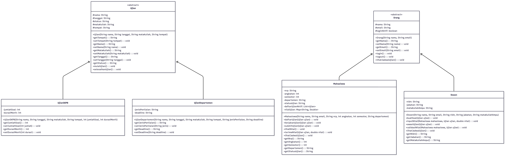
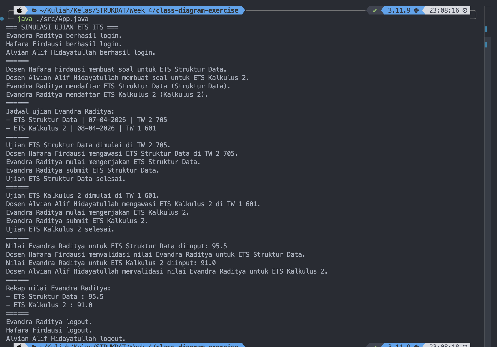

# Data Structure and OOP Week 4

Nama: Evandra Raditya Fauzan

NRP: 5027251001

Matkul: Struktur Data dan Pemrograman Berorientasi Objek A

## Deskripsi Kasus

Di ITS terdapat proses evaluasi yang selalu dilakukan tiap tengah dan akhir semester untuk setiap mata kuliah, yaitu ETS (Evaluasi Tengah Semester) dan juga EAS (Evaluasi Akhir Semester). Proses evaluasi ini adalah hal yang wajib dilakukan mahasiswa untuk mendapatkan nilai yang memuaskan pada setiap mata kuliah yang mereka jalani. Kode berikut akan melakukan simulasi ETS/EAS dari sudut pandang dosen dan juga mahasiswa.

## Class Diagram



Code: [diagram.mmd](./src/diagram.mmd)

## Kode Program Java

Seluruh implementasi class diagram dibuat dalam satu file Java:

- [src/App.java](./src/App.java)

Cara menjalankan program:

```bash
javac -d bin src/App.java
java -cp bin App
```

### Highlight Kode Penting

1. `Orang` sebagai abstract class untuk user (mahasiswa/dosen).

```java
abstract class Orang {
	protected String nama;
	protected String email;

	public void login() { ... }
	public void logout() { ... }

	public abstract void lihatJadwalUjian();
}
```

Penjelasan:

- Bagian ini menjadi kerangka dasar untuk `Mahasiswa` dan `Dosen`.
- Method `lihatJadwalUjian()` dibuat abstract agar implementasi jadwal bisa berbeda di tiap turunan.

2. `Ujian` sebagai parent class untuk semua jenis ujian

```java
abstract class Ujian {
	protected String nama;
	protected String tanggal;
	protected String status;

	public void mulaiUjian() {
		this.status = "BERLANGSUNG";
	}

	public void selesaikanUjian() {
		this.status = "SELESAI";
	}
}
```

Penjelasan:

- Menyatukan atribut penting ujian (nama, tanggal, status, mata kuliah, tempat).
- Method `mulaiUjian()` dan `selesaikanUjian()` menunjukkan pergantian status ujian.

3. Validasi mahasiswa saat daftar dan submit ujian

```java
public void daftarUjian(Ujian ujian) {
	if (daftarUjianAktif.contains(ujian)) {
		System.out.println(nama + " sudah terdaftar pada " + ujian.getNama() + ".");
		return;
	}
	daftarUjianAktif.add(ujian);
}

public void submitUjian(Ujian ujian) {
	if (!daftarUjianAktif.contains(ujian)) {
		System.out.println(nama + " belum terdaftar pada " + ujian.getNama() + ".");
		return;
	}
	statusUjian = "SUBMIT";
}
```

Penjelasan:

- Ada pengecekan agar mahasiswa tidak bisa daftar ganda.
- Ada pengecekan agar mahasiswa tidak bisa submit ujian yang belum didaftarkan.
- Ini membuat alur simulasi lebih realistis dan aman.

4. Penyimpanan nilai per ujian menggunakan `LinkedHashMap`

```java
private final Map<String, Double> nilaiUjian = new LinkedHashMap<>();

public void terimaNilai(Ujian ujian, double nilai) {
	nilaiUjian.put(ujian.getNama(), nilai);
}
```

Penjelasan:

- Nilai disimpan berdasarkan nama ujian.
- `LinkedHashMap` menjaga urutan input, jadi urutan data akan sesuai dengan kapan ujian diselesaikan, misal ujian strukdat sudah dinilai terlebih dahulu, maka data akan selalu pada posisi paling awal dari data yang lain.

5. Perbedaan Ujian SKPB dan Departemen

```java
class UjianDepartemen extends Ujian {
    private String jenisPenilaian;
    private String deadline;
}
```

Penjelasan:

- Ujian Departemen memiliki bentuk ujian yang lebih fleksibel, bisa berupa ujian teori menggunakan kertas/komputer, mid project, presentasi, demo, dsb.

6. Simulasi ujian di `main`

```java
mahasiswa.login();
dosen1.login();
dosen2.login();

dosen1.buatSoal(etsStrukdat);
mahasiswa.daftarUjian(etsStrukdat);

etsStrukdat.mulaiUjian();
mahasiswa.kerjakanUjian(etsStrukdat);
mahasiswa.submitUjian(etsStrukdat);

dosen1.inputNilai(mahasiswa, etsStrukdat, 95.5);
mahasiswa.lihatNilai();
```

Penjelasan:

- Bagian `main` melakukan alur lengkap sistem dari login sampai penilaian.
- Ini adalah inti simulasi ETS/EAS.

## Screenshot Output



Contoh output terminal saat program dijalankan:

```text
=== SIMULASI UJIAN ETS ITS ===
Evandra Raditya berhasil login.
Hafara Firdausi berhasil login.
Alvian Alif Hidayatullah berhasil login.
======
Dosen Hafara Firdausi membuat soal untuk ETS Struktur Data.
Dosen Alvian Alif Hidayatullah membuat soal untuk ETS Kalkulus 2.
Evandra Raditya mendaftar ETS Struktur Data (Struktur Data).
Evandra Raditya mendaftar ETS Kalkulus 2 (Kalkulus 2).
======
Jadwal ujian Evandra Raditya:
- ETS Struktur Data | 07-04-2026 | TW 2 705
- ETS Kalkulus 2 | 08-04-2026 | TW 1 601
======
Ujian ETS Struktur Data dimulai di TW 2 705.
Dosen Hafara Firdausi mengawasi ETS Struktur Data di TW 2 705.
Evandra Raditya mulai mengerjakan ETS Struktur Data.
Evandra Raditya submit ETS Struktur Data.
Ujian ETS Struktur Data selesai.
======
Ujian ETS Kalkulus 2 dimulai di TW 1 601.
Dosen Alvian Alif Hidayatullah mengawasi ETS Kalkulus 2 di TW 1 601.
Evandra Raditya mulai mengerjakan ETS Kalkulus 2.
Evandra Raditya submit ETS Kalkulus 2.
Ujian ETS Kalkulus 2 selesai.
======
Nilai Evandra Raditya untuk ETS Struktur Data diinput: 95.5
Dosen Hafara Firdausi memvalidasi nilai Evandra Raditya untuk ETS Struktur Data.
Nilai Evandra Raditya untuk ETS Kalkulus 2 diinput: 91.0
Dosen Alvian Alif Hidayatullah memvalidasi nilai Evandra Raditya untuk ETS Kalkulus 2.
======
Rekap nilai Evandra Raditya:
- ETS Struktur Data : 95.5
- ETS Kalkulus 2 : 91.0
======
Evandra Raditya logout.
Hafara Firdausi logout.
Alvian Alif Hidayatullah logout.
```

## Prinsip OOP yang Diterapkan

1. Abstraction

- Class `Orang` dan `Ujian` dibuat abstract untuk mendefinisikan secara umum kelas tersebut.
- Method abstract `lihatJadwalUjian()` pada `Orang` memaksa class turunan membuat implementasi, implementasi bisa berbeda pada beberapa kelas turunan, meski memiliki parent yang sama.

2. Inheritance

- `Mahasiswa` dan `Dosen` mewarisi class `Orang`.
- `UjianSKPB` dan `UjianDepartemen` mewarisi class `Ujian`.

3. Encapsulation

- Data penting disimpan sebagai atribut private/protected.
- Akses data dilakukan melalui method getter/setter, contohnya pada data identitas dan properti ujian.

4. Polymorphism

- Method `lihatJadwalUjian()` dipanggil menggunakan tipe `Orang`, tetapi cara kerjanya berbeda pada `Mahasiswa` dan `Dosen` (method overriding).

## Keunikan Program

Keunikan utama implementasi ini dibandingkan versi umum adalah program tidak hanya memetakan class diagram, tetapi juga mensimulasikan alur operasional ETS/EAS secara utuh dari awal sampai akhir.

Poin keunikan yang ditonjolkan:

1. Simulasi end-to-end ujian

- Alur yang disimulasikan mencakup login, pembuatan soal, pendaftaran ujian, pengerjaan, submit, input nilai, validasi nilai, lihat rekap nilai, hingga logout.

2. Dua tipe ujian berjalan bersamaan

- Dalam satu skenario terdapat `UjianDepartemen` dan `UjianSKPB`, sehingga terlihat perbedaan cara kerja pada setiap ujian skpb maupun pada departemen masing-masing.
